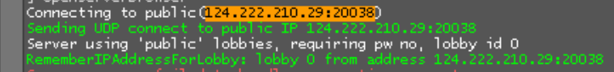

# L4D2 Server Blocker

Left 4 Dead 2의 매치메이커가 원치 않는 서버에 연결할 때, 해당 연결을 커널 레벨에서 가로채서 즉시 메인 타이틀 UI로 복귀시키는 프로그램입니다.

<a href="https://www.youtube.com/watch?v=X6DU8O_8J6Q"></a>

[시연 데모 영상](https://www.youtube.com/watch?v=X6DU8O_8J6Q)

## 문제

L4D2 매치메이커는 공식/사설 서버를 구별하지 못하고, 사설 서버 운영자측에 차단 (소위 '셀프밴')을 요청한들 그걸 들어주리라는 장담은 불가하며, Windows 방화벽으로 막으면 10회 재시도하므로 시간이 낭비됩니다. 

그래서 방에 들어갈 때마다 \`를 눌러 콘솔을 켜고, 지금 들어가려는 IP주소가 내가 원하지 않는 그 사설 서버인지 육안으로 구별한 뒤, 이에 해당하면 `disconnect`를 치거나 나가기를 누르는 번잡한 과정을 되풀이할 수밖에 없었습니다.

## 해결 방식

상기 문제를 해결하여 L4D2 클라이언트가 특정 사설 서버에 접속을 시도하는 즉시 메인 타이틀 UI로 넘어가도록 만들었습니다.

**이 프로그램은 L4D2 게임 자체를 위변조하는 것이 아니라 Windows 네트워크 스택에서 특정 서버행 패킷만 가로채 응답을 대신 돌려주는 방식입니다.** [WinDivert](https://reqrypt.org/windivert.html) 커널 드라이버로 차단 대상 서버행 outbound UDP 패킷을 가로채고, Source 엔진 프로토콜을 모방한 응답을 주입하여 L4D2 클라이언트가 즉시 연결을 포기하도록 만듭니다. 자세한 내용은 아래 '동작 원리'를 참고하세요.

```
Client ──A2S_GETCHALLENGE──▶ Blocked Server
         ▲ (WinDivert intercept)
         │
         └─ S2C_CHALLENGE    → auth protocol = 0 (invalid) → 즉시 Disconnect()
```

## 요구 사항

- Windows 10/11 (64-bit)
- 관리자 권한

## 사용법

1. 접속을 피하고자 하는 사설 서버의 IP 주소, 포트 리스트를 `blocked_servers.json`에 추가합니다.

- 차단할 서버의 IP 주소와 포트는 게임 내 콘솔(\` 키)에서 확인할 수 있습니다.



- 아래 예시를 참고하실 수 있습니다. 참고로 와일드카드도 지원합니다.

```json
[
    "12.34.56.78:270??",
    "12.34.56.78:270*",
    "12.34.56.*:270*",
    "12.34.56.78:27012"
]
```

2. `server_blocker.exe`를 더블클릭 후 관리자 권한으로 실행합니다. 이때 `server_blocker.exe`와 `blocked_servers.json`는 같은 폴더에 존재해야 합니다.


3. L4D2 게임을 켜서 평소처럼 플레이하세요. 차단한 서버에 접속을 시도하는 즉시 메인 UI로 복귀됩니다.

### 와일드카드 패턴

`blocked_servers.json`는 아래와 같이 와일드카드 패턴을 지원합니다. `*`는 해당 칸에서 자리수 상관 없이, 그리고 `?`는 해당 자리수의 문자 1개를 뜻합니다.

| 패턴 | 의미 | 예시 매치 |
|---|---|---|
| `12.34.56.78:27015` | 정확히 일치 | `12.34.56.78:27015` |
| `12.34.56.78:270??` | `?` = 아무 문자 1개 | `27000`~`27099` |
| `12.34.56.78:27*` | `*` = 아무 문자열 | `27`, `270`, `27014`, ... |
| `10.0.0.*:27015` | IP에도 사용 가능 | `10.0.0.0`~`10.0.0.255` |

## 적용 범위

L4D2 게임뿐 아니라 **Windows 전체**의 outbound UDP에 적용됩니다. WinDivert의 NETWORK 레이어는 프로세스(PID) 단위 필터링을 지원하지 않습니다. 만약 프로세스별 제한이 필요하면 SOCKET 레이어로 올라가는 것을 고려해볼 수는 있겠습니다.

> 아래부터는 기술적인 내용으로, 참고만 하시면 됩니다.

## 동작 원리

1. `blocked_servers.json`에서 패턴 로드
2. WinDivert 필터를 IP 기준으로 구성하여 커널 레벨에서 outbound UDP 캡처
3. 캡처된 패킷의 `IP:Port`를 `fnmatch`로 패턴 매칭
4. 매칭되지 않으면 원본 패킷을 그대로 통과 (re-inject)
5. 매칭되고 Source 엔진 `A2S_GETCHALLENGE` (`0x71`) 패킷이면:
   - 페이로드에서 `"connect0xXXXXXXXX"` 문자열의 challenge 값을 파싱
   - `S2C_CHALLENGE`(invalid auth protocol = 0) 위조 응답을 구성
   - IP/UDP 헤더의 src↔dst를 swap하고 inbound 방향으로 주입
   - 원본 outbound 패킷은 drop
6. 그 외 패킷은 silent drop

## 왜 즉시 차단되는가

### Windows 방화벽 (DROP) 방식의 한계

안 들어가고 싶은 서버로의 접속을 차단할 때 기본적으로 Windows 방화벽이 가장 손쉬운 방법입니다.

다만 Windows 방화벽으로 특정 IP를 차단하면, outbound 패킷은 단순히 **폐기**됩니다. 서버로부터 아무런 응답이 돌아오지 않으므로 L4D2 클라이언트는 연결이 실패한 것인지 아직 응답을 기다려야 하는 건지 (예시: 접속 시도 중에 서버측 맵 변경) 구별이 안됩니다. 결과적으로 클라이언트는 **10회 재시도**를 반복하는 과정에서 시간을 버려야 합니다.

```
Client ──A2S_GETCHALLENGE──▶ (방화벽 DROP) ──✕
         ... 타임아웃 대기 ...
Client ──A2S_GETCHALLENGE──▶ (방화벽 DROP) ──✕    ← 10회 반복
         ... 타임아웃 대기 ...
"Connection failed after 10 retries."
```

### Source 엔진 연결 핸드셰이크

L4D2(Source 엔진)의 서버 연결은 아래와 같이 UDP 기반의 connectionless 핸드셰이크로 시작됩니다.

1. **클라이언트 → 서버**: `A2S_GETCHALLENGE` (`FF FF FF FF 71`) 전송. 페이로드에 `"connect0xXXXXXXXX"` 형식으로 `retryChallenge` 값이 포함
2. **서버 → 클라이언트**: `S2C_CHALLENGE` (`FF FF FF FF 41`) 응답. 클라이언트의 `retryChallenge`를 에코하고, 서버 측 challenge와 **인증 프로토콜**(auth protocol)을 포함
3. 클라이언트는 인증 프로토콜 값을 확인하는데, 이때 유효한 값은 `PROTOCOL_STEAM = 3`이며, 그 외의 값이면 `Disconnect()`를 호출하고 즉시 연결을 중단

### 이 도구의 차단 방식

이 도구는 2단계에서 서버 대신에 응답합니다. WinDivert가 `A2S_GETCHALLENGE` outbound 패킷을 가로채면,

1. 원본 패킷의 페이로드에서 `retryChallenge` 값을 파싱 (`"connect0x"` 뒤 8자리 hex → 4바이트 little-endian 정수).
2. 위조 `S2C_CHALLENGE` 패킷을 아래와 같이 구성

```
FF FF FF FF 41              ← connectionless header + S2C_CHALLENGE
[retryChallenge:4]          ← 클라이언트가 보낸 challenge 에코
[server_challenge:4]        ← 임의의 값 (0x04030201)
[auth_protocol:4 = 0]      ← 핵심: 0은 유효하지 않은 인증 프로토콜
```

3. IP/UDP 헤더의 src↔dst를 swap하여 서버로부터 온 응답처럼 보이게 한 뒤, WinDivert로 **inbound 방향**으로 주입
4. 원본 outbound 패킷은 서버에 도달하지 않고 drop

클라이언트는 `auth_protocol = 0`을 읽고 `PROTOCOL_STEAM(3)`이 아님을 확인한 즉시 `Disconnect()`를 호출한다. 타임아웃이나 재시도 없이 **즉시** 연결이 해제되며, 메시지 없이 메인 타이틀 UI로 복귀합니다.

## Python으로 직접 실행 또는 직접 빌드하기

### Python으로 실행할 경우

- Python 3.10+ 필요
- `pip install pydivert`로 라이브러리 설치 후 아래와 같이 실행

```bash
# Python
python server_blocker.py
```

### 포터블 EXE로 빌드할 경우

```bash
pip install pyinstaller pydivert
pyinstaller --onefile --uac-admin --console \
  --add-data "<site-packages>/pydivert/windivert_dll/WinDivert64.dll;pydivert/windivert_dll" \
  --add-data "<site-packages>/pydivert/windivert_dll/WinDivert64.sys;pydivert/windivert_dll" \
  --add-binary "<python-env>/Library/bin/ffi.dll;." \
  server_blocker.py
```

빌드된 `server_blocker.exe`는 Python 없이 단독 실행 가능. UAC 매니페스트가 내장되어 더블클릭 시 자동으로 관리자 권한을 요청합니다.


## 라이선스

AGPLv3
